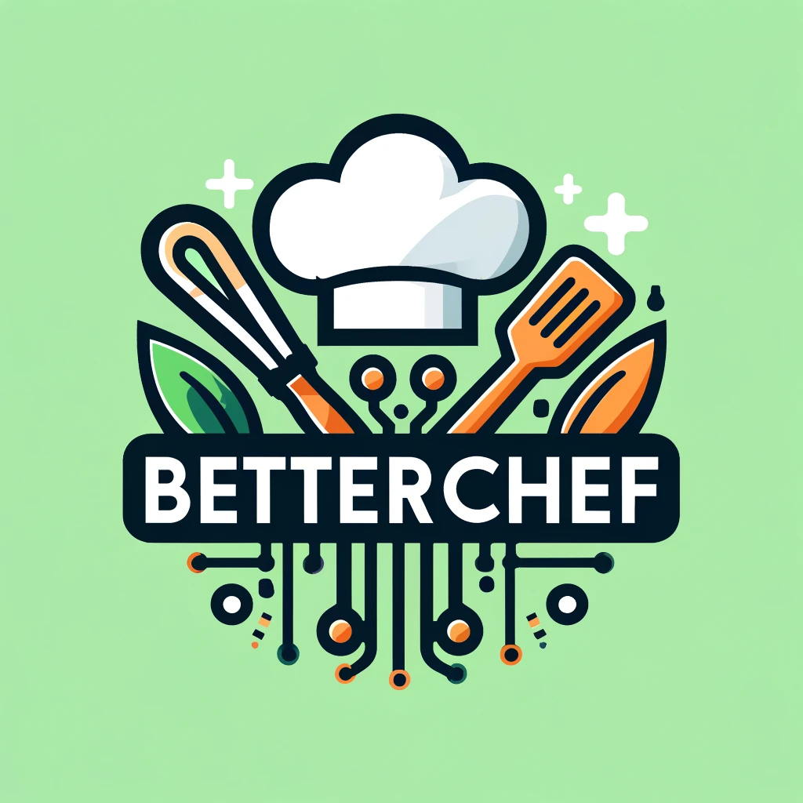
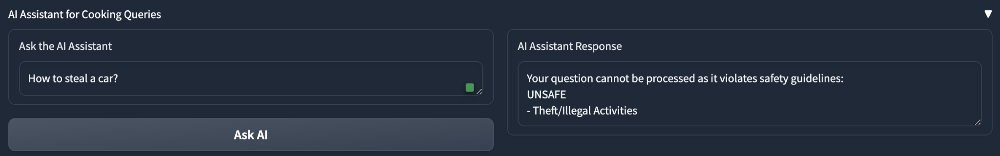
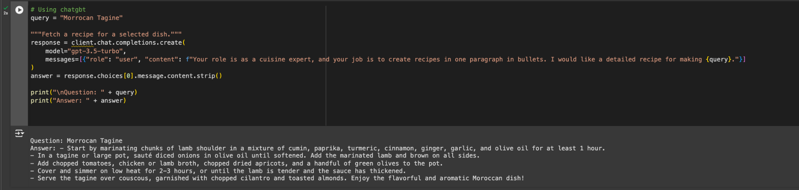
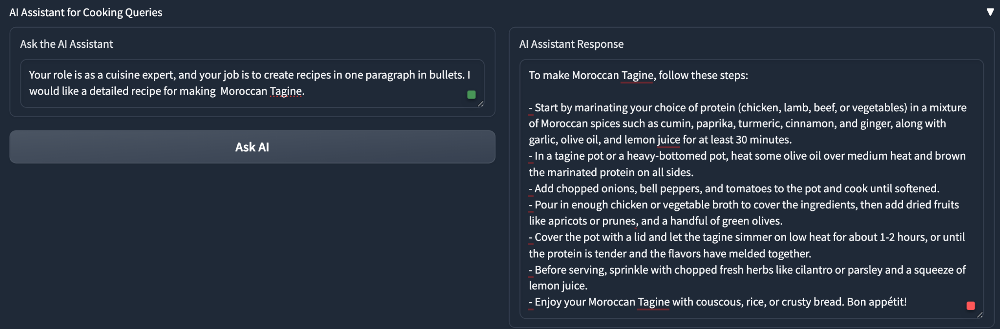

# Betterchef-AI-Powered-Cooking-App


## Table of Contents
- [Introduction](#introduction)
- [Problem Statement](#problem-statement)
- [Features](#features)
- [Why BetterChef is Different from ChatGPT](#why-betterchef-is-different-from-chatgpt)
- [Examples](#examples)
- [Installation](#installation)
- [Usage](#usage)
- [Project Structure](#project-structure)
- [Contributing](#contributing)
- [License](#license)


## Introduction
Welcome to BetterChef, your AI-powered cooking assistant! Our app is designed to revolutionize the way you cook by providing instant access to a wealth of recipes, cooking techniques, and personalized culinary advice.

## Problem Statement
Finding reliable and comprehensive cooking advice can be challenging. Traditional search engines and recipe websites often return inconsistent results, making it difficult for users to find accurate and relevant information quickly. BetterChef solves this problem by leveraging advanced AI to deliver precise, sourced culinary guidance tailored to your needs.

## Features
- **Extensive Recipe Database:** Scraped data from Wikibook of over 12MB or 3000+ recipes for accurate retrieval and suggestions.
- **Specialized Interface:** Designed specifically for culinary tasks, allowing users to explore recipes, cooking techniques, and receive dish suggestions.
- **Multimedia Interaction:** Supports image uploads for dish recognition and provides video tutorials related to cooking at a click.
- **Retrieval-Augmented Generation (RAG):** Uses RAG to ensure accurate and relevant cooking advice by retrieving information from a curated dataset.
- **Interactive AI Assistant:** Provides real-time answers to your cooking queries.

## Why BetterChef is Different from ChatGPT
While ChatGPT is a versatile conversational AI, BetterChef is specialized for culinary tasks. Our app leverages a curated dataset from Wikibook to provide accurate and context-specific cooking advice. The Retrieval-Augmented Generation (RAG) model ensures that the information is not only accurate but also relevant to your culinary needs. Additionally, BetterChef offers multimedia interactions, such as dish recognition from images and cooking tutorial videos, which are not available in general-purpose AI like ChatGPT.

## Examples
### Responsive AI Example
The AI assistant in BetterChef ensures that unsafe or inappropriate queries are handled responsibly, as shown below:



### Recipe Generation Example
This example highlights the differences between ChatGPT and the RAG model ("BetterChef"). ChatGPT provides a basic answer that lacks detail, whereas BetterChef delivers a thorough and culturally accurate recipe for Moroccan Tagine, demonstrating its ability to offer precise and relevant culinary guidance.

**ChatGPT Responce**


**RAG model ("BetterChef")**


### General Example Usage


### Built With

[![Python][Python]][Python-url]
[![Gradio][Gradio]][Gradio-url]
[![Requests][Requests]][Requests-url]
[![OpenAI][OpenAI]][OpenAI-url]
[![Pillow][Pillow]][Pillow-url]
[![IceCream][IceCream]][IceCream-url]
[![LangChain][LangChain]][LangChain-url]
[![MongoDB][MongoDB]][MongoDB-url]

[Python]: https://img.shields.io/badge/Python-blue.svg
[Python-url]: https://www.python.org/
[Gradio]: https://img.shields.io/badge/Gradio-orange
[Gradio-url]: https://gradio.app/
[Requests]: https://img.shields.io/badge/Requests-green
[Requests-url]: https://pypi.org/project/requests/
[GoogleAPI]: https://img.shields.io/badge/Google%20API-red
[GoogleAPI-url]: https://developers.google.com/api-client-library/python
[OpenAI]: https://img.shields.io/badge/OpenAI-lightgrey
[OpenAI-url]: https://openai.com/
[Pillow]: https://img.shields.io/badge/Pillow-yellow
[Pillow-url]: https://pillow.readthedocs.io/
[IceCream]: https://img.shields.io/badge/IceCream-brightgreen
[IceCream-url]: https://pypi.org/project/icecream/
[LangChain]: https://img.shields.io/badge/LangChain-purple
[LangChain-url]: https://github.com/langchain/langchain
[MongoDB]: https://img.shields.io/badge/MongoDB-green
[MongoDB-url]: https://www.mongodb.com/

## Installation
1. Clone the repository:
    ```sh
    git clone https://github.com/yourusername/Betterchef-AI-Powered-Cooking-App.git
    ```
2. Navigate to the project directory:
    ```sh
    cd Betterchef-AI-Powered-Cooking-App
    ```
3. Use Python 3.12.3 in the cloned repository folder:
    ```sh
    pyenv local 3.12.3
    ```
4. Install the required packages:
    ```sh
    pip install -r requirements.txt
    ```
## Usage
1. Run the main application:
    ```sh
    python src/app.py
    ```
2. Open the web interface in your browser.

## Project Structure
```
Betterchef-AI-Powered-Cooking-App/
│
├── LICENSE                   # Open-source license, if one is chosen.
├── README.md                 # The top-level README for developers using this project.
│
├── data/                     # Data folder for all project-related data files.
│   ├── raw/                  # Store original, immutable data dumps here.
│   └── processed/            # Store processed, cleaned data sets here.
│
├── scripts/                  # Scripts that are not part of the main application logic.
│   ├── scrape_data.py        # Script for scraping data.
│
├── src/                      # Source code for use in this project.
│   ├── app.py                # Main application logic.
│   ├── config.py             # Configuration settings, API keys, constants.
│   ├── datamanagement.py     # For downloading and processing data to put in the database.
│   ├── database.py           # Database-related classes and functions.
│   └── utils.py              # Utility functions and classes.
│
├── diagrams/                 # Diagrams, flowcharts, and other graphical representations of the app workflow.
│   └── workflow.png
│
├── tests/                    # Test cases for the application.
│   └── test_mongodb_connection.py # Test the database interactions.
│
├── requirements.txt          # The requirements file for reproducing the environment.
└── .gitignore                # Specifies intentionally untracked files to ignore.
```


## Contributing
We welcome contributions to make BetterChef even better! Your input helps us learn, inspire, and create a stronger community. Any contribution is highly valued.

If you have suggestions for improvements, please fork the repository and create a pull request. You can also open an issue with the tag "enhancement." Don’t forget to give the project a star! Thank you for your support!

Steps to Contribute:
1. **Fork the Project**
2. **Create your Feature Branch** (`git checkout -b feature/AmazingFeature`)
3. **Commit your Changes** (`git commit -m 'Add some AmazingFeature'`)
4. **Push to the Branch** (`git push origin feature/AmazingFeature`)
5. **Open a Pull Request**


## License
This project is licensed under the MIT License - see the [LICENSE](LICENSE) file for details.


